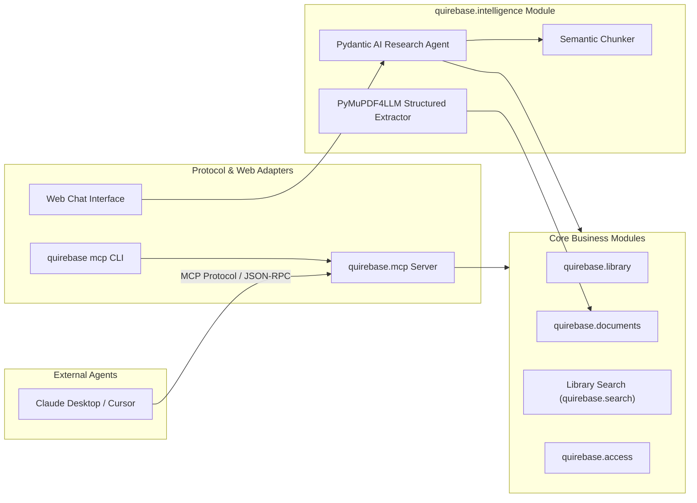

# 4. Research Intelligence, Model Context Protocol (MCP), and Agent Architecture

Date: 2026-08-15

## Status

Accepted

## Context

Scholarly workflows increasingly leverage Large Language Models (LLMs) and autonomous agents for literature review, semantic synthesis, equation/table extraction, and automated annotation. However, integrating AI must not violate the core architectural invariants established in ADR-0001 (Deferred Integrations & Ports/Adapters) and ADR-0002 (Modular Monolith Organization by Business Capabilities).

Specifically:
1. Core business modules (`library`, `documents`, `access`, `projects`) must remain pure, decoupled from vendor LLM SDKs and prompt engineering logic.
2. External AI tools (such as Claude Desktop, Cursor, IDE plugins, CLI agents) require a standardized protocol to inspect libraries, query full-text, and create annotations.
3. PDF text extraction for research papers requires structural fidelity—preserving LaTeX mathematical formulas, markdown tables, section hierarchies, and figure captions.

## Decision

We establish two decoupled layers for AI and language model integration:

### 1. Domain Capability: `quirebase.intelligence`
A dedicated capability module providing:
- **Structural Extraction (`extraction.py`)**: Uses `pymupdf4llm` (with fallback to structured PyMuPDF extraction) to transform a **File Revision** into structured Markdown with LaTeX math formulas (`$...$`) and Markdown tables.
- **Semantic Chunking (`chunking.py`)**: Header-aware document chunking for Retrieval-Augmented Generation (RAG).
- **Research Agent (`agent.py`)**: Type-safe research assistant agent built on **Pydantic AI**, providing structured outputs (`ItemSummary`, `LiteratureReview`, `SynthesisOutput`) and tool calling across Quirebase capabilities.

### 2. Protocol Adapter: `quirebase.mcp` (Model Context Protocol)
An inbound protocol adapter exposing Quirebase capabilities as an MCP Server (over standard I/O and SSE):
- **Tools**: `search_library`, `get_item`, `get_item_fulltext`, `list_projects`, `get_annotations`, `create_annotation`.
- **Resources**: `quirebase://items/{item_id}`, `quirebase://projects/{project_id}`.
- **Prompts**: `literature_review`, `item_summary`.

## Consequences

- Core library and storage operations remain 100% independent of AI dependencies.
- External agent ecosystems can read and write to Quirebase without custom integration code.
- Research papers preserve mathematical equations and structured tables when processed by LLMs.
- Agents can run with either local models (e.g. Ollama) or cloud providers via configurable runtime settings.
