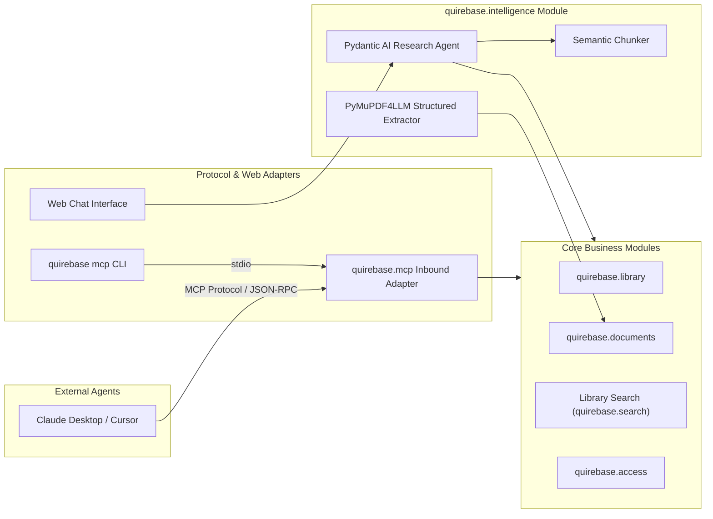

# 4. Research Intelligence, Model Context Protocol (MCP), and Agent Architecture

Date: 2026-08-15

## Status

Accepted

Tracking: [#1 Plan staged Research Intelligence and MCP capabilities](https://github.com/Jadeiin/quirebase/issues/1)

## Context

Scholarly workflows increasingly leverage Large Language Models (LLMs) and autonomous agents for literature review, semantic synthesis, equation/table extraction, and automated annotation. However, integrating AI must not violate the core architectural invariants established in ADR-0001 (Deferred Integrations & Ports/Adapters) and ADR-0002 (Modular Monolith Organization by Business Capabilities).

Specifically:
1. Core business modules (`library`, `documents`, `access`, `projects`) must remain pure, decoupled from vendor LLM SDKs and prompt engineering logic.
2. External AI tools (such as Claude Desktop, Cursor, IDE plugins, CLI agents) require a standardized protocol to inspect libraries, query full-text, and create annotations.
3. PDF text extraction for research papers requires structural fidelity—preserving LaTeX mathematical formulas, markdown tables, section hierarchies, and figure captions.

## Candidate Direction

If the proposal is validated, Quirebase would establish two decoupled layers for AI and
language model integration. The concrete libraries, protocols, transports, and module
interfaces remain subject to staged research and implementation decisions tracked in #1.

### 1. Domain Capability: `quirebase.intelligence`
A dedicated capability module providing:
- **Structural Extraction (`extraction.py`)**: Uses `pymupdf4llm` (with fallback to structured PyMuPDF extraction) to transform a **File Revision** into structured Markdown with LaTeX math formulas (`$...$`) and Markdown tables.
- **Semantic Chunking (`chunking.py`)**: Header-aware document chunking for Retrieval-Augmented Generation (RAG).
- **Research Agent (`agent.py`)**: Type-safe research assistant agent built on **Pydantic AI**, providing structured outputs (`ItemSummary`, `LiteratureReview`, `SynthesisOutput`) and tool calling across Quirebase capabilities.

### 2. Protocol Adapter: `quirebase.mcp` (Model Context Protocol)

An inbound protocol adapter built with FastMCP 3 over the official MCP SDK. Remote access uses
stateless Streamable HTTP; standard input/output is reserved for a client launching a trusted local
process. The superseded HTTP+SSE transport is not a new implementation target.

The typed FastAPI `/api/v1` contract is the canonical application protocol. MCP tools are a curated
OpenAPI-derived projection of those routes, executed through an in-process ASGI client. The adapter
keeps a fixed operation allowlist and supplies MCP-specific names, descriptions and safety
annotations; it does not duplicate application orchestration or response DTOs. API Tokens are
verified by the MCP transport and again by the API dependency. A request-local trusted context
preserves MCP tool and token provenance for Audit Events without accepting client-controlled
provenance headers.

The server exposes a fixed allowlist covering the ordinary User's core research workflows:

| Capability | Tools | Deliberate limits |
| --- | --- | --- |
| Library | `library.search_items`, `library.get_library_item`, `library.create_library_item`, `library.update_library_item` | Search is limited to 25 Items per page; writes reuse Item ownership and optimistic version checks |
| Projects | `projects.list_projects`, `projects.get_project`, `projects.create_user_project`, `projects.update_project`, lifecycle, item and membership tools | Project Role checks remain authoritative, including owner-only membership changes |
| Documents | `documents.list_documents` | Returns revision and attachment metadata, never object keys, bytes or extracted text |
| Annotations | `annotations.list_annotations`, `annotations.create_annotation`, `annotations.update_annotation`, `annotations.delete_annotation` | Reuses revision, Item and Project visibility plus annotation ownership/version rules |
| Organization | `library.list_tags`, `library.add_item_tag`, `library.remove_item_tag`, `library.set_item_tag_selection`, `library.list_discussions`, `library.create_discussion`, `library.delete_discussion` | Reuses editable-Item and message ownership rules |
| Discovery and citation | `discovery.search_discovery`, `library.format_item_citation` | Discovery is marked open-world and never receives the inbound API Token |

The allowlist deliberately omits administrative and operational capabilities. It also omits file
upload/download and extracted full text: the current full text is an unstructured plain-text field
and needs a bounded structured-document interface before it becomes an MCP capability. Resources
and prompts are not required for this tool-oriented slice. API Tokens do not carry separate
read/write or per-tool scopes; adding a tool changes the server allowlist for every valid token and
therefore requires its own authorization and behaviour review.

Every generated tool forwards the already verified Bearer credential only to the in-process API
client. The API verifies it again, derives the User and invokes the existing business Interface,
which continues to apply System Role, Project Role, Item ownership, transaction and Audit Event
rules. Tool input never selects the authorization subject.

Programmatic Adapters bind protocol, operation and API Token/client identity through the Audit
Module interface. A successful data-changing operation records one business Audit Event enriched
with that invocation source; it does not also record a protocol event. Security-sensitive reads
such as Discovery retain their dedicated business Audit Event, while ordinary successful reads do
not create persistent per-call records. MCP validation failures, authorization failures and other
protocol outcomes likewise do not create Audit Events; operational diagnostics for those paths
belong in redacted logs and metrics rather than the immutable business audit history. Tool
arguments, bearer credentials and result content are never added to Audit Events.

For Streamable HTTP, the Accounts Module issues revocable, expiring API Tokens and stores only their
hashes. MCP accepts them only as `Authorization: Bearer` credentials; browser Login Sessions and
CSRF tokens are not MCP credentials, query-string tokens are rejected, and an inbound token is
never passed to an upstream Provider. The raw token is shown only once at creation. This deliberately
does not implement MCP OAuth authorization discovery: deployment and client configuration are
simpler, at the cost of interactive OAuth acquisition, delegated clients and step-up scopes.

## Expected Consequences If Accepted

- Core library and storage operations remain 100% independent of AI dependencies.
- External agent ecosystems can read and write to Quirebase without custom integration code.
- Research papers preserve mathematical equations and structured tables when processed by LLMs.
- Agents can run with either local models (e.g. Ollama) or cloud providers via configurable runtime settings.
- Protocol and transport behaviour follows FastMCP and the official MCP SDK rather than a
  Quirebase JSON-RPC implementation.
- MCP and HTTP cannot drift into parallel orchestration paths because both execute the same API
  operations and response contracts.
- API Tokens expire, can be revoked, and immediately lose access when their User is deactivated.
- Tool availability is server-wide; User- and object-level authorization remains authoritative.
