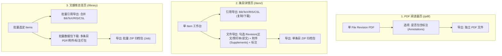

# Item UI/UX 改进规划

本文把条目（Item）详情页、引用导出、文件操作和上游元数据同步视为一个
“Item workspace”体验来规划。参考 `~/Code/i-librarian-free` 的可发现操作、
导出对话框、剪贴板和摘要卡片，但沿用 Quirebase 已有的 Item、Document、
File Revision、Attachment、Annotation、Tag 和 Citation Style 领域语言。

## 现状与目标

当前详情页的 Summary 让中栏只承载摘要和外链，右栏却堆叠基本信息、标识符、
动态和关键词；导出入口是多个链接加一个浅层下拉框；文件操作分散在 Files
分区；CSL 样式由固定的 6 项白名单包裹 `citeproc-py-styles`，并且没有统一的
导出选项模型。

目标是让用户在打开一个 Item 后能在一个稳定的工作台内完成三类高频任务：

1. 快速阅读和判断（标题、作者、摘要、PDF、来源和状态）；
2. 快速采取行动（阅读、下载、同步、复制引用、导出、删除）；
3. 深入维护（元数据、标识符、文件、组织、Annotation 和 Discussion）。

## 建议的信息架构

### 顶部操作栏

把长排链接改为固定、分组且可响应式折叠的操作栏：

- 主要动作：`打开 PDF`、`下载 PDF`（带下拉支持选择主 PDF 或特定 Revision）；
- 次要动作：`同步元数据`、`复制引用`（一键复制常用格式）、`导出`（打开导出模态）；
- 危险动作：`删除 Item`，放入“更多”菜单并弹出详细影响确认框；
- 标题下显示作者、出版物、年份和来源徽标，不再把这些字段挤进右栏。

`复制引用` 使用最近一次导出设置生成文本并写入 Clipboard API；首次使用或
浏览器不支持时，回退为选中可复制的文本框并显示明确状态。`导出` 打开模态/抽屉，
集中提供引用与文件归档选项。

### Summary 的两列改造

中栏成为可滚动的阅读摘要区，右栏变成窄的“快速事实”区，且右栏只放可在
一屏内扫完的内容：

- 中栏：摘要（默认折叠到约 5 行，底部提供渐变遮罩与“展开/收起”切换）、图形摘要/首个 PDF 缩略图、外链
  作为带图标的来源卡片、关键词作为可点击 Tag-like chips；
- 右栏：年份、类型、期刊/出版社、卷期页、DOI/Provider 标识符、PDF/Attachment/
  Annotation/Discussion 数量；
- 过长字段（affiliation、完整 URL、全部关键词、更新时间和同步历史）移动到
  `Metadata` 或 `Activity` 抽屉；
- 在窄屏上右栏顺序下移为折叠卡片，不使用固定高度造成二次滚动。

这借鉴 i-Librarian 的摘要、补充材料、UID、标签等卡片分块，但不复制其把所有
卡片纵向堆在同一长页面的缺点。

### 本地导航

保留现有 `Overview / Metadata / Files / Organize / Notes and annotations /
Discussion` 六个 workspace section；在 `Overview` 只放“判断和行动”内容。
导航项显示计数徽标（例如 `Files (2)`、`Notes & annotations (5)`、`Discussion (1)`），
计数为 0 时仍保留入口，避免用户猜测功能是否存在。

## 三级业务导出体系

导出功能按用户操作场景划分为三个清晰层级：

| 层级 | 场景 | 导出对象 | 核心选项 | 输出形态 | 负责模块 |
| :--- | :--- | :--- | :--- | :--- | :--- |
| **层级 1：PDF 阅读器** | `/pdf/<id>` | 当前打开的单一 File Revision | • 是否包含标注（高亮与下划线） | 单个 PDF 文件（即时流式下载） | `documents` |
| **层级 2：条目工作台** | `/item/<id>` | 单个 Item 的完整工作台 | • **引用**：格式、CSL 样式、摘要/期刊缩写/标题大小写保护 • **文件**：勾选 Revision、附件、标注 | 剪贴板文本 / `.bib` / `.ris` / 单条目 ZIP 归档 | `discovery` (引用) `documents` (文件归档) |
| **层级 3：文献库总览** | `/library` | 批量选中的多个 Items | • **批量引用**：合并导出 • **批量文件**：主 PDF、附件、标注 | 批量引用文本/文件 / 批量 ZIP 归档 | `discovery` (引用) `library.bulk_items` + `documents` (批量归档) |

### 一个 Export Options 模型

导出模态包含：

- 格式：BibTeX、RIS、EndNote、CSL 渲染文本；
- CSL 样式：可搜索的样式选择器，搜索名称、slug、厂商/学科关键词；显示样式
  预览和最近使用项；
- BibTeX/CSL 选项：`包含摘要`、`保护 bibitem 大小写`、`期刊名使用缩写`；
- 输出目标：`下载文件` 或 `复制到剪贴板`；复制目标禁用不适合纯文本的选项，
  并显示成功/失败反馈；
- 多 Item 导出时显示数量和缺失字段提示，而不是逐条弹错；
- 提供“恢复导出默认设置”按钮，一键重置本地持久化偏好。

### BibTeX 大小写保护规则

“保护 bibitem 大小写”必须在 BibTeX 序列化层实现：
- **严格限定作用域**：仅应用于 `title`、`booktitle`、`series` 等标题类字段。
- **严禁作用于作者名**：BibTeX 规范依靠 `format.names$` 解析人名，且从不对 `author` / `editor` 调用 `change.case$`；给作者名添加内部大括号会破坏姓氏缩写、von 前缀判定及机构作者语义。
- **防止重复嵌套**：序列化时需检测既有大括号深度，对已包裹 `{...}` 的词素保持原样，不生成双重嵌套 `{{...}}`。
- “期刊名缩写”明确优先级：有 `journal_abbreviation` 时使用它，否则保持完整刊名，不猜测或联网补全。

### CSL 样式来源

删除 `BUILTIN_STYLES` 的固定 6 项产品白名单及其“没有安装就静默消失”的回退
语义。改为由 `citeproc-py-styles` 安装包枚举实际可用 CSL 文件，建立只读样式
目录（slug、title、language、categories、filepath），并在启动/依赖变更时缓存。
用户自定义 `CitationStyle` 继续单独显示为“我的样式”。

样式选择器支持服务端查询或前端按目录筛选；不能把完整数千项目录一次性塞入
HTML。样式缺失、CSL 无效或 citeproc 额外依赖未安装时，导出接口返回可操作错误，
不得回退到硬编码样式。

建议的深模块接口：`list_citation_styles(query, scope)`、
`render_export(items, ExportOptions)`、`copy_export(items, ExportOptions)`。
Web 只负责表单解析和响应格式；样式解析、BibTeX 选项和媒体类型留在
`discovery`/其导出实现内。

## 下划线标注（Underline Annotation）能力

在原有高亮（Highlight）与文本笔记（Note）基础上，补充下划线标注形态支持：

1. **领域与模型**：`AnnotationKind.UNDERLINE`，经由数据库迁移 `0015_annotation_underline.py` 支持。
2. **阅读器工具**：PDF 阅读器顶部工具栏提供“下划线”标注笔刷与快捷键切换，颜色与样式遵循设计系统规范。
3. **几何与段落**：下划线标注与高亮共享同一基于 PDF 视口与文本盒的四边形坐标（Quads）计算逻辑。
4. **导出支持**：导出带标注的 PDF 时，由 `documents` / `pipeline` 注释层生成器将下划线转换为标准 PDF `/Underline` 注释或展平渲染。

## Item 级文件和危险操作

顶部操作栏与工作区分区提供：

- `下载 PDF`：选择 File Revision；若存在多个版本，显示版本、页数、处理状态和
  文件名；
- `下载 PDF（高级）`：选项 `保留 Annotation`、`包含 Attachment/supplements`。
  选择后生成一个临时 ZIP（主 PDF + 可选 sidecar/Attachment），沿用现有 Job、
  TTL 和清理机制；不改变原始 File Revision；
- `删除 Item`：只对 Item Owner/管理员显示，弹出确认模态框，明确“Item、File Revision、Attachment、
  Annotation、Project membership 将永久删除”，要求输入确认，并记录
  Audit Event。单条删除调用 Library 的单 Item 删除用例，不复用 bulk 表单。

Files 分区仍提供逐文件下载；顶部动作只做高频快捷入口。Annotation 保留应明确
导出的格式（建议 PDF 注释层 + JSON sidecar），无法嵌入的 Annotation 必须给出
警告而不是静默丢失。

## 标识符和上游同步

### 数据语义

`ItemIdentifier(provider, value)` 是 Provider 级 Upstream Identifier 的唯一展示和
同步来源。OpenAlex 的值规范化为 `W...`（去掉 URL 前缀、保持大小写约定）；
DOI 只保留在 Item.canonical DOI 字段，不再额外建立 `provider=doi` 的展示行。
现有 `identifiers` JSON 与关系表并存会产生双写风险，迁移计划应以关系表为真源，
完成读取切换后再删除冗余列。

### 同步后的引用键

同步元数据后默认执行一次“候选引用键重算”，但必须保护用户明确编辑过的键：

- Item 没有手工锁定键，或键仍等于上一次自动生成值：自动更新；
- 用户在 Metadata 中修改过键：只显示变更预览和“应用新键”；
- 记录旧键、新键、触发 Provider 和操作者到 Audit Event。

不要用数据库通用 hook 触发此行为。SQLAlchemy `after_update`/数据库 trigger 无法
可靠区分“上游同步”和普通编辑，也难以处理搜索索引、Audit Event、并发版本和失败
回滚。把它放在 `sync_metadata_from_upstream` 的应用用例中，作为同一事务里的显式
策略；未来若有第二个触发来源，再抽出 `synchronize_item_metadata` 深模块并由
同步和批处理共同调用。引用键冲突仍由现有 Library 接口集中校验。

## 分阶段实施

### Phase 0：契约和埋点

- 为导出、复制、下载高级选项、删除和同步后的键变更补齐 use-case/result 类型；
- 增加 UI 行为测试和可访问性基线（键盘操作、焦点、Clipboard 失败）；
- 统计各操作入口使用率和导出失败原因。

### Phase 1：无迁移的 UI 重排

- 重做 Item header、Summary 两列、计数导航和响应式断点；
- 顶部加入 PDF 下载、复制引用、导出、删除入口；
- 复用现有 endpoint，先把文件操作和危险操作放到正确位置。

### Phase 2：导出深模块

- 枚举 `citeproc-py-styles` 全目录并实现可搜索选择器；
- 统一 `ExportOptions`，加入摘要、大小写、期刊缩写和 Clipboard；
- 删除固定 6 项白名单和无依赖回退；补齐单 Item 与批量导出的契约测试。

### Phase 3：文件打包与标识符收敛

- 实现带 Annotation/Attachment 选项的 PDF ZIP Job；
- 关系表成为 Upstream Identifier 真源，迁移和清理 JSON/DOI 重复展示；
- 在同步用例中加入引用键重算策略和审计。

### Phase 4：打磨与验证

- 用真实长摘要、超长作者名、多标识符、无 PDF、多 Attachment 和窄屏进行视觉回归；
- 以“打开 Item 后 10 秒内找到下载/复制/同步/删除”做可用性验收；
- 检查所有按钮的权限、CSRF、版本冲突、错误恢复和 Audit Event。

## 验收标准

- CSL 样式可搜索且来自实际安装目录；卸载 citation extra 时不会出现假样式或静默回退；
- 单 Item 和批量导出共享同一 `ExportOptions` 语义，下载与复制内容完全一致；
- BibTeX 大小写保护仅作用于标题字段，不修改作者名与专有缩写；
- PDF 高级下载不会修改源文件，Annotation/Attachment 选择可验证；
- OpenAlex `W...` 等 Upstream Identifier 可直接同步，DOI 不重复显示；
- 同步后的引用键遵守“自动键可更新、手工键需确认”的规则，并记录新旧引用键审计；
- Summary 首屏不再出现右栏长滚动，所有高频动作在顶部或 Files 卡片可达；
- 删除、下载、同步和导出均有权限、并发、错误和审计测试。

## 当前实现状态

- 已完成：三级导出选项与模型统一、动态 CSL 搜索、用户自定义样式搜索、剪贴板复制、单 Item
  删除、带 Annotation/Attachment 选项的 PDF Bundle、同步后的自动引用键策略。
- 已完成：下划线标注（Underline Annotation）类型与迁移 `0015_annotation_underline`，阅读器绘制与导出支持。
- 已完成：Summary 右栏的动态和关键词改为按需展开，Tools 页不再展示固定的 CSL
  白名单，而是使用动态搜索目录。
- 已完成：迁移 `0014_canonical_doi` 删除历史 `ItemIdentifier(provider="doi")`，并从
  `items.identifiers` JSON 清除 DOI；新写入只使用 Item.canonical DOI 字段，不保留
  旧接口或双写兼容层。
